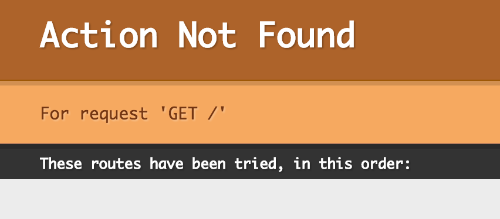

Let's say Hello World! with Play Framework
---

The Play framework is a MVC style web application framework for JVM. It provides API for both Java and Scala programming languages. You can use it to build either your traditional web applications with server side rendering or modern single page web applications(SPA) that uses REST with JavaScript MVC framework like AngularJS. One design decision that makes Play different from other Java/Scala MVC web frameworks is that it is not built on top of the Servlet standard. Instead, it is full stack Java framework that runs your application stand-alone. **Play is a framework not a library**.

## Prerequisite

To work along with this tutorial, you will need following installed on your machine.

1. [Download and install latest JDK 8 update](http://www.oracle.com/technetwork/java/javase/downloads/jdk8-downloads-2133151.html) on your operating system. I am using JDK version `1.8.0_60`.

2. [Download and install latest Scala version](http://www.scala-lang.org/download/) on your machine. I am using Scala `2.11.7`.

3. [Download and install the latest SBT version](http://www.scala-sbt.org/download.html) on your machine. I am using SBT version `0.13.11`.

4. An IDE of your choice. You can use either of [IntelliJ](https://www.jetbrains.com/idea/download/) or [Eclipse](http://scala-ide.org/). I prefer IntelliJ.

5. You should be comfortable reading and writing Scala code. Throughout the tutorial series, we will also use SBT so in case you are not familiar with SBT then you can read [my SBT tutorial](https://github.com/shekhargulati/52-technologies-in-2016/tree/master/02-sbt).

## Github repository

The code for today’s demo application is available on github: [blogy](./blogy).

## Getting started with Play framework

In this series, we will use the latest Play framework version `2.5.0`. Play documentation recommends that one should use a tool called **Activator** to quickly get started with Play framework. Activator is a wrapper over SBT and scaffold a new project using templates. There are a lot of official and community templates that you can choose from. I had a bad experience with official Play Scala template so I prefer manual approach of setting my projects. The official `Play Scala` template generates a lot of code and it becomes difficult to understand why you need all the things. We will go the manual way so that we can understand how everything stitch together. I find manual way of setting Play project less intimidating and easier to understand.

Open a new command-line terminal and navigate to a convenient location on your file system where you want to host the application source code.

```bash
$ mkdir blogy && cd blogy
```

Create the following layout inside the `blogy` directory.

```
|-- app
|   `-- controllers
|-- conf
`-- project
```

You can use the command mentioned below to create the above mentioned directory structure.

```bash
$ mkdir -p app/controllers conf project
```

We will start with creating our build file `build.sbt`. Play uses SBT to build and run the project. Create a new file `build.sbt` inside the root i.e. `blogy` directory and populate it with following contents.

```scala
name := "blogy"

version := "1.0.0-SNAPSHOT"

lazy val root = (project in file(".")).enablePlugins(PlayScala)

scalaVersion := "2.11.7"
```

The build file shown above does the following:

1. It specifies name of the project as `blogy`.
2. Then, we specified version of the project as `1.0.0-SNAPSHOT`.
3. Next, it enables `PlayScala` plugin for `blogy` project. Later in this tutorial, we will add Play SBT plugin to our project.
4. Finally, we set Scala version `2.11.7` that we will use in this project.

Now, we will add Play Scala plugin so that our project is treated as a Play application. In SBT, you add plugins to a `plugins.sbt` file inside the `project` directory. Create a new file `plugins.sbt` inside the project directory and populate it with following contents.

```scala
addSbtPlugin("com.typesafe.play" % "sbt-plugin" % "2.5.0")
```

This is one required SBT plugin that you need. There are many more plugins like `sbt-coffeescript`, `sbt-less`, `sbt-scalariform`,etc that we can add for adding different capabilities. We will add few more plugins later in the series.

It is a good practice in SBT projects to also lock down version of SBT. By default, the installed version on your machine will be used. This might cause compatibility issues if future version of SBT becomes incompatible with Play. To force a SBT version, create a new file `build.properties` inside the `project` directory and add following contents to it.

```
sbt.version=0.13.11
```

Now, to test our current setup launch the `sbt` command from inside the `blogy` directory. You will see output as shown below.

```bash
$ sbt
```
```
[info] Loading project definition from /Users/shekhargulati/dev/git/play-the-missing-tutorial/blogy/project
[info] Updating {file:/Users/shekhargulati/dev/git/play-the-missing-tutorial/blogy/project/}blogy-build...
[info] Resolving org.fusesource.jansi#jansi;1.4 ...
[info] Done updating.
[info] Set current project to blogy (in build file:/Users/shekhargulati/dev/git/play-the-missing-tutorial/blogy/)
```

Write `play` and press tab you will see all play specific tasks.

```
[blogy] $ play
playAggregateReverseRoutes   playAllAssets                playAssetsClassloader        playAssetsWithCompilation    playCommonClassloader        playCompileEverything
playDefaultAddress           playDefaultPort              playDependencyClassloader    playDependencyClasspath      playDevSettings              playDocsJar
playDocsModule               playDocsName                 playExternalizeResources     playExternalizedResources    playGenerateReverseRouter    playGenerateSecret
playInteractionMode          playJarSansExternalized      playMonitoredFiles           playNamespaceReverseRouter   playOmnidoc                  playPackageAssets
playPlugin                   playPrefixAndAssets          playReload                   playReloaderClassloader      playReloaderClasspath        playRoutes
playRoutesGenerator          playRoutesImports            playRoutesTasks              playRunHooks                 playStop                     playUpdateSecret
```

To run a Play project, you can use the `run` task. It will start the server at port `9000`.

```
[blogy] $ run

--- (Running the application, auto-reloading is enabled) ---

[info] p.c.s.NettyServer - Listening for HTTP on /0:0:0:0:0:0:0:0:9000

(Server started, use Ctrl+D to stop and go back to the console...)
```

You can access the application at [http://localhost:9000/](http://localhost:9000/). If you do it, you will be greeted with an error page with following error message.

```
java.io.IOException: resource not found on classpath: application.conf, application.json
```

Every play framework application needs a configuration file `application.conf` inside the configuration directory. Create a new file `application.conf` and populate it with following contents.

```
application{
  langs = "en"
}
```

The above configuration specifies the language supported by the application. You can specify multiple languages by separating them by comma.

`application.conf` uses HOCON(Human Optimized Config Object Notation) notation.  According to [HOCON documentation](https://github.com/typesafehub/config/blob/master/HOCON.md),

> **The primary goal is: keep the semantics (tree structure; set of types; encoding/escaping) from JSON, but make it more convenient as a human-editable config file format.**

Access the index page [http://localhost:9000/](http://localhost:9000/) again and this time you will be greeted by different error message.



The reason for this error message is that we have not mapped any action to the GET request to `\` url.

## "Hello, World" with Play

You now have a working Play application environment that we can use to get started with our first Play controller. In Play, you write controllers which defines Action methods that process the request and return the response. The decision to select the Action is made by the router which uses the `routes` configuration to select the correct Action.

To handle the `\` request, we have to create a controller that will define an Action. We will define URL mapping to controller Action inside `routes` configuration file.

Create your first controller inside the `app/controllers`. We will name our controller `IndexController` as it is handling the index request.

```scala
package controllers

import play.api.mvc._

class IndexController extends Controller {

  def index() = Action {
    Ok("Hello, World!")
  }

}
```

The code shown above does the following:

1. It import all the classes and traits inside the `play.api.mvc` package.
2. Next, we created a Scala class that extends `Controller` trait. `Controller` provides access to all the utility methods to generate `Action` and `Result` types.
3. Finally, we created a method `index` that returns an `Action`. Action is a function `Request[A] => Result` that takes a request and returns a result. We returned Http status Ok i.e. 200 with `Hello, World!` text in the response body. Action syntax `Action{}` is possible because of a `apply` method defined in the `Action` object that takes a block `final def apply(block: => Result): Action[AnyContent]`.

Now, we will map the index URL `\` to index `Action` by defining the configuration in the `routes` configuration. Create a new file `routes` inside the `conf` directory.

```
# Routes
# This file defines all application routes (Higher priority routes first)
# ~~~~

GET     /       controllers.IndexController.index()
```

As is obvious, we are mapping HTTP GET request to `\` to `controllers.IndexController.index()`.

You can now test that `\` url is working by either opening [http://localhost:9000/](http://localhost:9000/) in the browser or using a command-line tool like cURL as shown below.

```
$ curl -i http://localhost:9000/
HTTP/1.1 200 OK
Content-Length: 13
Content-Type: text/plain; charset=utf-8
Date: Thu, 24 Mar 2016 19:06:54 GMT

Hello, World!
```

You can map multiple URL to same action by defining the route configuration. Let's suppose we want to map both `\` and `index` to the same controller then we can update our `routes` file as shown below.

```
GET     /            controllers.IndexController.index()
GET     /index       controllers.IndexController.index()
```

You can stop the running server by pressing `Ctrl+D`. This will take you back to the SBT shell. If you will press `Ctrl+C` then SBT process will also exit and you will be back to your command-line terminal.

---

That's it for the first part of Play framework. If you have any feedback then you can add a comment to this Github issue [https://github.com/shekhargulati/play-the-missing-tutorial/issues/1](https://github.com/shekhargulati/play-the-missing-tutorial/issues/1).

[](https://github.com/igrigorik/ga-beacon)
