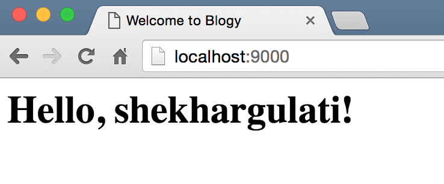
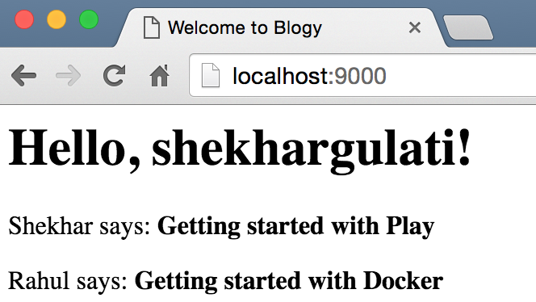

Play Scala Templates
---

In the [previous chapter](./01-hello-world.md), we created a basic Play Scala application that renders `Hello, World!` when a Http GET request is made to index `\`. You can run the application by executing `sbt run` command from inside the application root directory.

We will start this chapter from where we left in last chapter, so you may want to make sure you have the above application correctly installed and working.

## Github repository

The code for demo application is available on github: [blogy](./blogy). You should get the `part-02` release. If you are not comfortable with Git, then you can directly download the [part-02.zip](https://github.com/shekhargulati/play-the-missing-tutorial/archive/part-02.zip).

## Why we need templates?

Let's start with the use case that we have to render HTML page when user visits our application. The page should have welcome message with name of the logged in user. In this chapter, we will ignore the fact that we don't have user authentication and authorization in place. We will use a dummy user to convey the point.

One way to render HTML would be to return the HTML in the response body as shown below.

```scala
package controllers

import play.api.mvc._

class IndexController extends Controller {

  def index() = Action {
    val user = Map("username" -> "shekhargulati")
    Ok {
      s"""
         |<html>
         |  <head>
         |    <title>Home Page</title>
         |  </head>
         |  <body>
         |    <h1>Hello, ${user.getOrElse("username", "guest")}</h1>
         |  </body>
         |</html>
      """.stripMargin
    }.as("text/html")
  }

}
```

In the code shown above, we modified the `index` method to return HTML in the response body. `Ok` is factory method to produce `Result`. `Result` is value object which defines the response header and a body ready to send to the client. We set the `Content-Type` to `text/html` using the `as` method so that browser render it as html.

Go to [http://localhost:9000/](http://localhost:9000/) to see how it looks in your browser.

The approach we have taken above is a quick and easy hack to render HTML but it will not scale for complex pages. It will very quickly become unmanageable as we are mixing multiple concerns together.

## Templates can help

Template allows you to separate presentation concern from the rest of the application. This makes it easy for UI designers to work independently on the user interface concern without being bothered by the application source code.

Play comes bundled with Twirl, a powerful Scala based template engine.

Let's write our first template. Templates are created inside the `application/views` directory. Create new file `index.scala.html` and populate it with following content.

```html
@(title: String, user: Map[String, String])
<html>
<head>
    <title>@title</title>
</head>
<body>
    <h1>Hello, @user.getOrElse("username","guest")!</h1>
</body>
</html>
```

As you case see above, we mostly wrote a standard HTML page with some placeholders marked with `@` for dynamic content. Every time Twirl template engine encounters `@` character, it indicates the beginning of a dynamic statement. If you have used other templates engines like mustache or jinja then you would have used placeholders like `{{}}`. The statement after `@` is valid Scala code as you can see from `@user.getOrElse("username","guest")`. We are calling `getOrElse` function of `Map`.

> **Because @ is a special character, you’ll sometimes need to escape it. Do this by using @@.**

One thing that we have not discussed is the first line of template `@(title: String, user: Map[String, String])`. Let's decipher this statement. Each Twirl template is compiled to a function. The first line defines the parameters of this template function. The index template function needs two parameters of type `String` and `Map[String, String]`. Now, the controller who will use this template will have to pass these as method parameters or template will not compile and you will see compilation error when you will view the page.

Now, let's see how we can use the template defined above in our controller.

```scala
package controllers

import play.api.mvc._

class IndexController extends Controller {

  def index() = Action {
    val user = Map("username" -> "shekhargulati")
    Ok(views.html.index("Welcome to Blogy", user))
  }

}
```

In the code shown above, we are returning the index template instead of hard coded HTML. You can also notice that we are passing the function parameters as well. `index` is a class with an `apply` method so you can call as you are calling a function.

Let's understand what happens when you return a template using `views.html.index("Welcome to Blogy", user)`. When the view is rendered for the first time, `index.scala.html` template is compiled to a class with same name as template i.e. index in our case. This class extends from `BaseScalaTemplate`, which is the base class for all Twirl templates. This class has all the utility methods that the template might need to convert the `index.scala.html` template to actual html. `index` class also extend one trait `play.twirl.api.Template*`, `*` depends on the number of parameters template needs. In our case, `play.twirl.api.Template2` as we have two parameters defined in the `index.scala.html` template. The index class looks as shown below.

```scala
import play.twirl.api._

class index extends BaseScalaTemplate[HtmlFormat.Appendable,Format[HtmlFormat.Appendable]](HtmlFormat) with Template2[String,Map[String, String]],HtmlFormat.Appendable] {

    def apply(title: String, user: Map[String, String]):HtmlFormat.Appendable = {
      ...
    }
}
```

You can view the application by opening [http://localhost:9000/](http://localhost:9000/)  in your favorite browser. It will look something like as shown below.



## Using Control statements in templates

Twirl templates have support for control statements. Let's add an if statement that will render username if it exists in the Map or `Guest` otherwise.

```html
@(title: String, user: Map[String, String])
<html>
<head>
    <title>@title</title>
</head>
<body>
    @if(user.get("username").isDefined){
        <h1>Hello, @user.get("username").get!</h1>
    }else{
        <h1>Hello, Guest!</h1>
    }
</body>
</html>
```

Feel free to test it by removing username from the Map to see control statement in action.

## Iteration in templates

The logged in user in our `blogy` application will probably want to see recent posts from followed users in the home page, so let's see how we can do that.

Let's update the controller to return a list of posts as well. Now, the `views.html.index` function is taking three parameters. We have to change our template to reflect that.

```scala
package controllers

import play.api.mvc._

class IndexController extends Controller {

  def index() = Action {
    val user = Map("username" -> "shekhargulati")
    val posts = List(
      Map("author" -> "Shekhar",
        "body" -> "Getting started with Play"
      ),
      Map("author" -> "Rahul",
        "body" -> "Getting started with Docker"
      )
    )
    Ok(views.html.index("Welcome to Blogy", user, posts))
  }

}
```

We are using a List to store a post. Each post is Map with key value pairs. Later in this series, we will use a real database to store and fetch the data. For now, we will go with in-memory data structure representing data from the database.

Let's update our template to add `posts` as its parameter.  To iterate over list, we will use the `for` loop as shown below.

```html
@(title: String, user: Map[String, String], posts: List[Map[String, String]])
<html>
<head>
    <title>@title</title>
</head>
<body>
    @if(user.get("username").isDefined){
        <h1>Hello, @user.get("username").get!</h1>
    }else{
        <h1>Hello, Guest!</h1>
    }
    @for(post <- posts){
        <div><p>@post.getOrElse("author","Guest") says: <b>@post.getOrElse("body","Hello!")</b></p></div>
    }
</body>
</html>
```

The page will be rendered as shown below.



## Defining reusable layout templates

One good practice when working with templates is to make sure they don't duplicate content. To achieve that, you should define layout that templates can reuse. Our `blogy` web application will need to have a navigation bar at the top of the page with a few links. Here you will get the link to edit your profile, to login, logout, etc.

We can create a new template `layout.scala.html` that will define a base template that includes the navigation bar and page structure.

```html
@(title: String)(content: Html)
<!DOCTYPE html>
<html>
<head>
    <title>@title</title>
</head>
<body>
    <div>Blogy: <a href="/">Home</a></div>
    <hr>
    <section class="content">@content</section>
</body>
</html>
```

As you can see above, layout template takes two parameters: a title and an HTML content block.

We will update `index.scala.html` to use the base layout.

```html
@(title: String, user: Map[String, String], posts: List[Map[String, String]])
@layout(title) {
    @if(user.get("username").isDefined){
        <h1>Hello, @user.get("username").get!</h1>
    }else{
        <h1>Hello, Guest!</h1>
    }
    @for(post <- posts){
        <div><p>@post.getOrElse("author","Guest") says: <b>@post.getOrElse("body","Hello!")</b></p></div>
    }
}
```

---

That's it for the second part of Play framework tutorial. If you have any feedback then you can add a comment to this Github issue [https://github.com/shekhargulati/play-the-missing-tutorial/issues/1](https://github.com/shekhargulati/play-the-missing-tutorial/issues/1).

[](https://github.com/igrigorik/ga-beacon)
